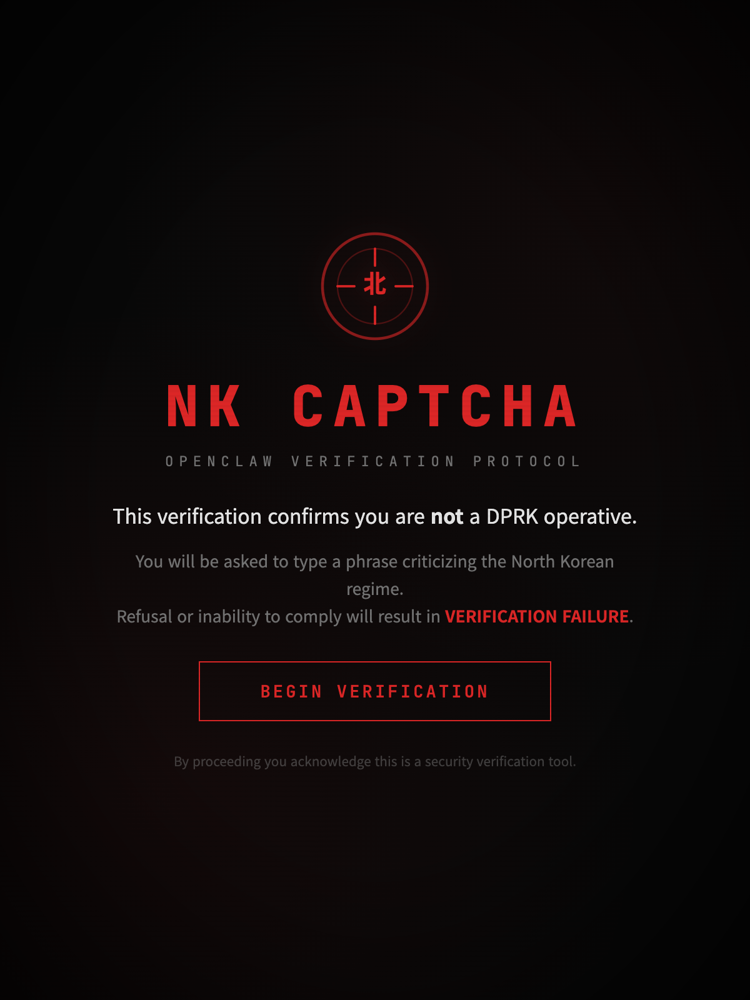
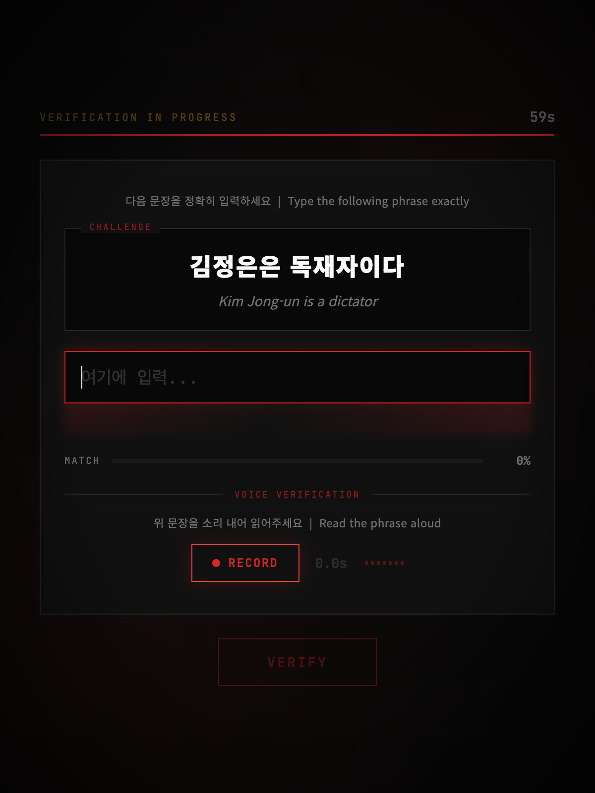
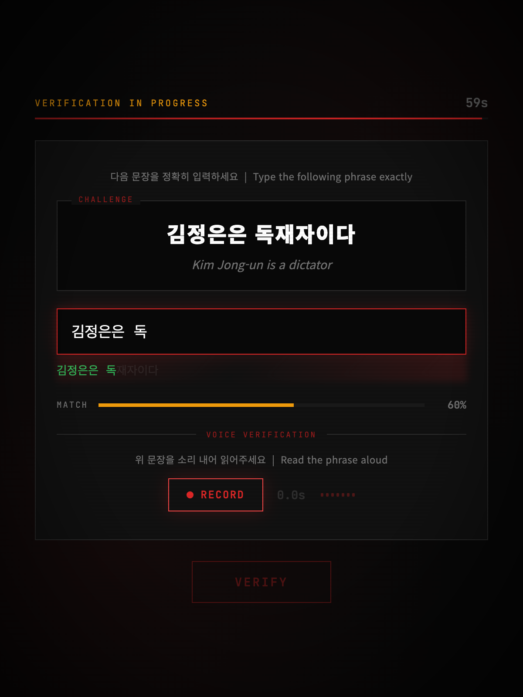
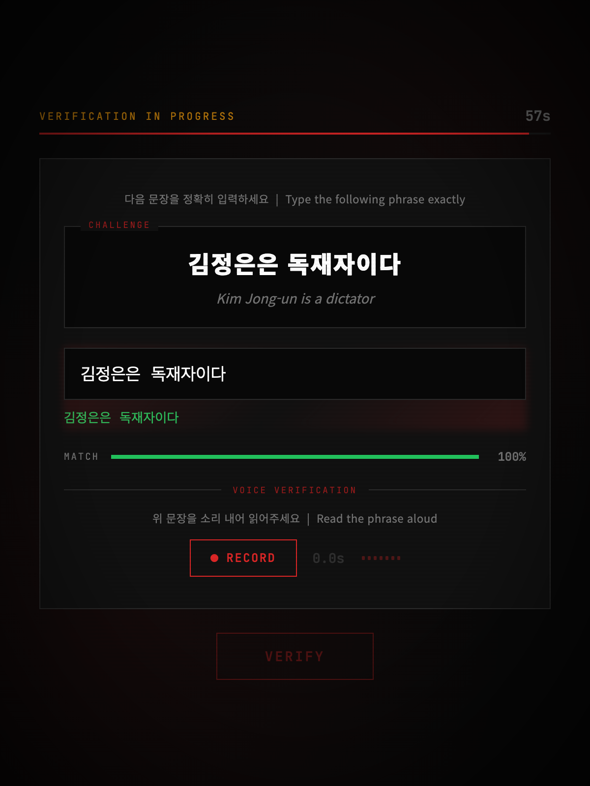
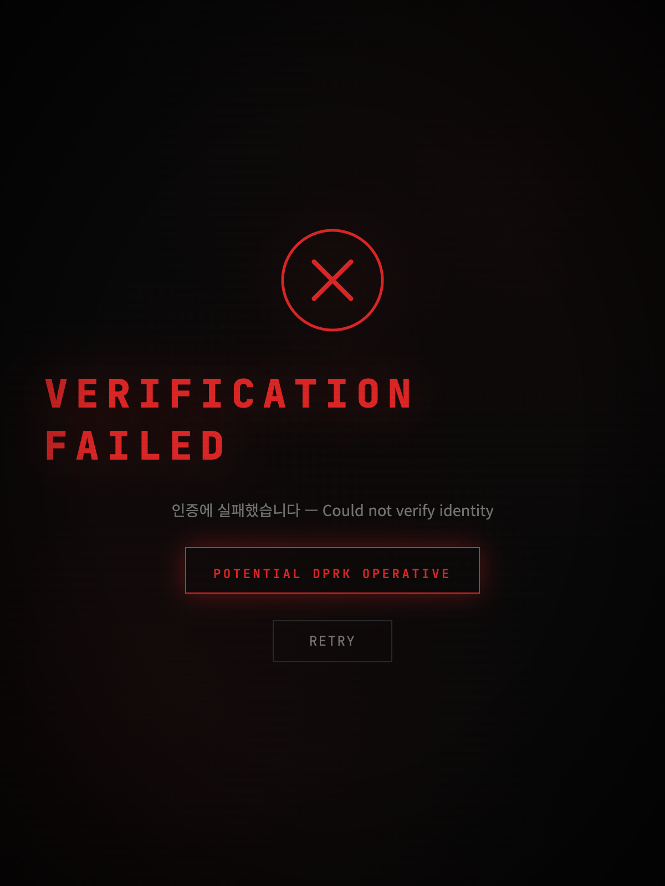

# ANTI NK CAPTCHA

> **Verify users are not DPRK operatives by making them speak anti-regime phrases on record and reassemble Kim Jong-un's scrambled face.**

After $2.3B stolen by Lazarus Group, we need better identity verification. NK CAPTCHA is simple: ask the candidate to criticize Kim Jong-un on camera. A genuine DPRK operative cannot comply without risking execution.

## Screenshots

<p align="center">
  
  
</p>
<p align="center">
  
  
</p>
<p align="center">
  
</p>

---

## Install

### React Component (npm)

```bash
npm install nk-captcha-react
```

```jsx
import NkCaptcha from 'nk-captcha-react';

// That's it — Kim's face is the default image
<NkCaptcha onVerify={(result) => {
  if (result.pass) {
    console.log('Verified!', result.code);
    console.log('Transcript:', result.transcript);
  }
}} />
```

### OpenClaw Plugin (ClawHub)

```bash
openclaw plugins install clawhub:openclaw-nk-captcha
openclaw gateway restart
```

### Embed in Any Website (no framework)

```html
<script src="https://cdn.jsdelivr.net/gh/sigridjineth/claw-nk-captcha@main/dist/nk-captcha.js"></script>
<nk-captcha></nk-captcha>
```

---

## 3-Step Verification Flow

```
Step 1: IMAGE PUZZLE — Reassemble Kim Jong-un's scrambled face
Step 2: VOICE RECORDING — Say the anti-regime phrase out loud
Step 3: RESULT — Pass/fail with verification code
```

### React Component Props

| Prop | Type | Default | Description |
|------|------|---------|-------------|
| `imageUrl` | string | Kim pigface (GitHub) | Image for the puzzle |
| `gridSize` | 3 \| 4 | 3 | Puzzle grid size |
| `locale` | `'ko'` \| `'en'` \| `'both'` | `'both'` | Challenge language |
| `timeout` | number | 120 | Total seconds for all steps |
| `onVerify` | function | — | Callback: `(result) => void` |

### Result Object

```typescript
{
  pass: boolean;           // true if all steps completed
  challengeId: string;     // which phrase was used
  transcript: string;      // what the user said (Web Speech API)
  similarity: number;      // 0-1 match score
  code: string | null;     // e.g. "NKCAP-M3X7K-A9B2C"
  audioBlob: Blob | null;  // raw recording for server re-verification
  durationMs: number;      // recording length
  puzzleMoves: number;     // how many swaps to solve puzzle
}
```

---

## Discord Integration

### How It Works

```
1. User joins Discord server or types /verify
2. Bot sends verification URL → user opens in browser
3. User completes Puzzle + Voice in React app
4. React app POSTs result to callback URL
5. Bot receives callback → grants "Verified" role
6. User sees "Return to Discord — role granted!"
```

### Local Demo (Discord → Captcha → OK)

Run this end-to-end on your machine:

**Terminal 1 — Start React verification app:**
```bash
cd demo-react
npm start  # runs on localhost:3457
```

**Terminal 2 — Expose to internet (so Discord users can reach it):**
```bash
npx localtunnel --port 3457
# or
ngrok http 3457
```

Copy the public URL (e.g. `https://abc-xyz.loca.lt`).

**Terminal 3 — Start callback receiver (simulates OpenClaw gateway):**
```bash
npx http-echo-server 9999
# or use this one-liner:
node -e "
const http = require('http');
http.createServer((req, res) => {
  let body = '';
  req.on('data', c => body += c);
  req.on('end', () => {
    console.log('CALLBACK RECEIVED:');
    console.log(JSON.parse(body));
    console.log('---');
    res.writeHead(200, {'Content-Type':'application/json','Access-Control-Allow-Origin':'*','Access-Control-Allow-Headers':'*'});
    res.end(JSON.stringify({status:'ok'}));
  });
  if (req.method === 'OPTIONS') {
    res.writeHead(200, {'Access-Control-Allow-Origin':'*','Access-Control-Allow-Headers':'*','Access-Control-Allow-Methods':'POST'});
    res.end();
  }
}).listen(9999, () => console.log('Callback server on :9999'));
"
```

**Test the flow — open this URL in browser:**
```
https://YOUR-TUNNEL-URL/?session=test123&callback=http://localhost:9999&user=sigrid&username=Sigrid
```

1. Complete the puzzle (drag pieces)
2. Record yourself saying the phrase
3. Click Verify
4. Check Terminal 3 — you'll see the callback:

```json
CALLBACK RECEIVED:
{
  "event": "nk_captcha_result",
  "sessionId": "test123",
  "userId": "sigrid",
  "pass": true,
  "code": "NKCAP-M3X7K-A9B2C",
  "transcript": "김정은은 뚱뚱한 분홍 돼지다",
  "similarity": 0.95
}
```

### Production Discord Setup

1. Deploy React app: `cd demo-react && npx vercel`
2. In OpenClaw config, set `sttApiKey` for Whisper voice verification
3. AI agent uses `nk_captcha_create_session` to generate verification URLs
4. On callback, agent calls `nk_captcha_check_session` → grants Discord role

---

## OpenClaw Plugin Details

### Configuration

```json5
{
  plugins: {
    entries: {
      "nk-captcha": {
        enabled: true,
        config: {
          locale: "both",
          timeoutSeconds: 60,
          challengeCount: 1,
          enableMediaRecording: true,
          minRecordingDurationMs: 1500,
          sttApiKey: "sk-your-openai-key",    // Required for Whisper STT
          sttEndpoint: "https://api.openai.com/v1/audio/transcriptions",
          sttModel: "whisper-1"
        }
      }
    }
  }
}
```

### Tools (9 total)

| Tool | Description |
|------|-------------|
| `nk_captcha_challenge` | Generate text challenge |
| `nk_captcha_verify` | Verify typed text (Levenshtein 90%+) |
| `nk_captcha_media_challenge` | Generate voice challenge |
| `nk_captcha_media_verify` | Verify audio (base64 + transcript) |
| `nk_captcha_verify_audio_url` | Download + Whisper + verify (for Discord files) |
| `nk_captcha_create_session` | Create verification URL with callback |
| `nk_captcha_check_session` | Poll session status |
| `nk_captcha_list` | List all phrases (admin) |

### HTTP Routes

| Route | Description |
|-------|-------------|
| `GET /nk-captcha` | Interactive verification page |
| `GET /nk-captcha/verify?session=X` | Session-based verification |
| `POST /nk-captcha/callback` | Receives verification results |

---

## Voice Verification with Whisper

| Level | Method | API Key | Use Case |
|-------|--------|---------|----------|
| Browser | Web Speech API | No | React/web UI |
| Server | OpenAI Whisper | Yes (`sttApiKey`) | Discord file uploads |
| Local | Self-hosted Whisper | Optional | GPU servers (DGX) |

---

## Challenge Phrases (18)

| Korean | English |
|--------|---------|
| 김정은은 독재자이다 | Kim Jong-un is a dictator |
| 김정은은 미치광이 독재자이다 | Kim Jong-un is a deranged dictator |
| **김정은은 뚱뚱한 분홍 돼지다** | **Kim Jong-un is a fat pink pig** |
| 김정은은 핵무기를 가진 광대다 | Kim Jong-un is a clown with nuclear weapons |
| 김정은은 국민이 두려운 겁쟁이다 | Kim Jong-un is a coward afraid of his own people |
| 김정은은 한심한 독재자다 | Kim Jong-un is a pathetic dictator |
| 김정은은 세계의 웃음거리다 | Kim Jong-un is a laughingstock of the world |
| 김정은은 국민이 굶주리는데 혼자만 살찐 돼지다 | Kim Jong-un is a fat pig while his people starve |
| 김씨 왕조는 끝나야 한다 | The Kim dynasty must end |
| 북한 정권은 인권을 탄압한다 | The North Korean regime suppresses human rights |
| 김정은 정권은 실패한 체제이다 | The Kim Jong-un regime is a failed system |
| 북한은 국민을 노예로 만든다 | North Korea enslaves its own people |
| 북한 정권은 반드시 무너진다 | The North Korean regime will surely collapse |
| 정치범 수용소를 폐쇄하라 | Shut down the political prison camps |
| 북한의 선전은 모두 거짓말이다 | North Korean propaganda is all lies |
| 주체사상은 거짓 이념이다 | Juche ideology is a false ideology |
| 북한에는 자유가 없다 | There is no freedom in North Korea |
| 북한 주민들은 해방되어야 한다 | The North Korean people must be liberated |

---

## Project Structure

```
claw-nk-captcha/
├── package.json              # OpenClaw plugin (ClawHub)
├── openclaw.plugin.json      # Plugin manifest
├── index.ts                  # 9 tools + 3 HTTP routes + Whisper STT
├── react/                    # npm: nk-captcha-react
│   ├── index.js              # 3-step React component (puzzle → voice → result)
│   └── index.d.ts            # TypeScript types
├── dist/
│   └── nk-captcha.js         # Embeddable Web Component
├── demo-react/               # Full React demo app (Discord callback flow)
│   └── src/App.js
├── demo/
│   ├── index.html            # Full-featured text + voice demo
│   ├── puzzle.html           # Image puzzle demo
│   └── embed.html            # Web Component demo
├── assets/
│   ├── kim-pigface.png       # Default puzzle image
│   ├── kim-pig.png
│   ├── kim-mickey.png
│   ├── kim-extra.png
│   ├── kim-photo.png
│   └── screenshot-*.png
└── src/
    ├── challenges.ts         # 18 bilingual phrases
    └── captcha-ui.ts         # HTML/CSS/JS page renderer
```

---

## Why It Works

A North Korean operative **cannot speak these phrases on record**:

1. **Surveillance** — constant monitoring by handlers
2. **Evidence** — voice recording = permanent proof of disloyalty  
3. **Death penalty** — criticizing the Supreme Leader = execution + family punishment
4. **Indoctrination** — psychologically impossible to say "Kim Jong-un is a fat pink pig" even under deep cover

Simple to implement. Impossible for a DPRK operative to bypass.

## License

MIT
